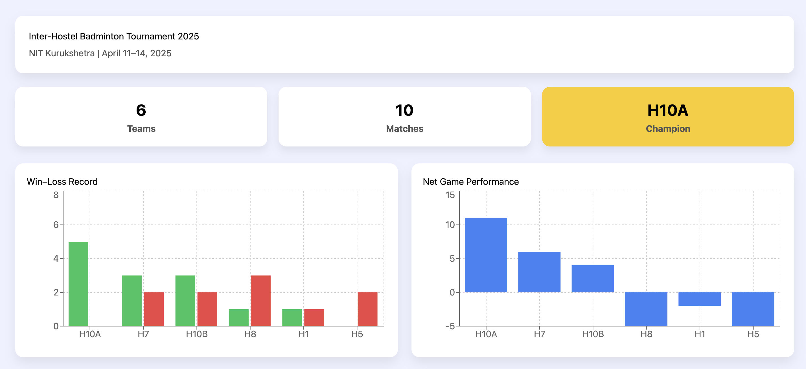
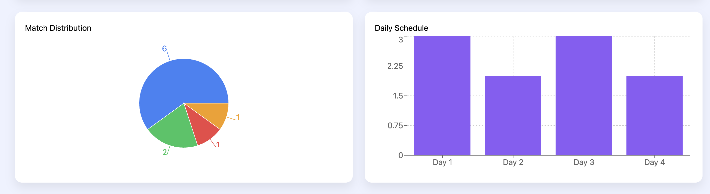
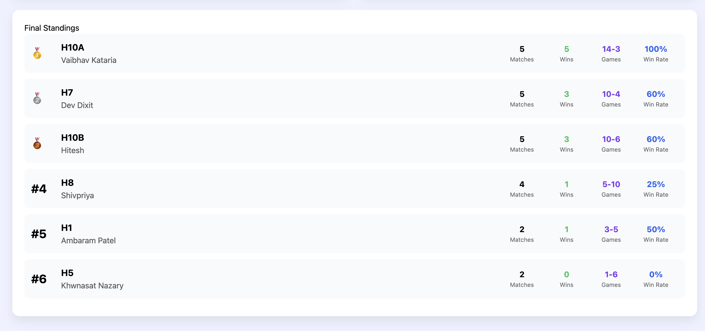

# 🏸 Badminton Tournament Analytics

A comprehensive data analytics portfolio project analyzing Inter-Hostel Badminton Tournament at NIT Kurukshetra.

## 🎯 Project Overview

This project demonstrates end-to-end data analysis skills:
- **SQL Server Database** with normalized schema (7 tables)
- **35+ T-SQL Queries** showcasing advanced analytics
- **Python Analysis** with pandas, matplotlib, seaborn
- **Interactive React Dashboard** with data visualizations
- **Real Tournament Data** from April 2025

## 🏆 Tournament Results

- 🥇 Champion: H10A (Hostel 10 Block A)
- 🥈 Runner-up: H7 (Hostel 7)
- 🥉 Third Place: H10B (Hostel 10 Block B)

## 🛠 Tech Stack

- **Database:** Microsoft SQL Server / Azure SQL Edge
- **Backend:** Python 3.9+, pandas, SQLAlchemy, pyodbc
- **Visualization:** matplotlib, seaborn, Recharts
- **Frontend:** React 18, Tailwind CSS
- **Tools:** Azure Data Studio, VS Code, Git

## 📦 Project Structure
badminton-analytics/
├── database/           # SQL Server schema and queries
│   ├── schema.sql
│   └── queries/       # 35+ analytical queries
├── analysis/          # Python analysis scripts
│   ├── main_analysis.py
│   └── config.example.py
├── dashboard/         # React dashboard
├── visualizations/    # Generated charts
├── exports/          # CSV reports
└── docs/             # Documentation

## 🚀 Quick Start

### Prerequisites
- Docker Desktop (for SQL Server)
- Python 3.9+
- Node.js 16+
- ODBC Driver 18 for SQL Server

### Setup

1. **Start SQL Server:**
```bash
docker run -e "ACCEPT_EULA=Y" \
  -e "MSSQL_SA_PASSWORD=YourStrong!Passw0rd" \
  -p 1433:1433 --name sql_server -d \
  mcr.microsoft.com/azure-sql-edge
```

2. **Create Database:**
```bash
sqlcmd -S localhost -U sa -P 'YourStrong!Passw0rd' \
  -Q "CREATE DATABASE badminton_db"
sqlcmd -S localhost -U sa -P 'YourStrong!Passw0rd' \
  -d badminton_db -i database/schema.sql
```

3. **Python Setup:**
```bash
python3 -m venv venv
source venv/bin/activate
pip install -r requirements.txt

# Configure database connection
cp analysis/config.example.py analysis/config.py
# Edit config.py with your credentials

# Run analysis
cd analysis
python3 main_analysis.py
```

4. **Dashboard:**
```bash
cd dashboard
npm install
npm start
```

## 📊 Key Features

### SQL Analysis (35+ Queries)
- Basic retrieval & filtering
- Aggregations & GROUP BY
- Multi-table JOINs
- Window functions (ROW_NUMBER, RANK, NTILE)
- CTEs and subqueries
- Advanced analytics

### Python Analysis
- Automated ETL pipeline
- Statistical analysis
- Professional visualizations
- CSV export functionality

### Interactive Dashboard
- Tournament overview
- Team performance comparison
- Match analysis
- Drill-down capabilities

## 📈 Sample Insights

- **Competitive Balance:** 30% of matches decided by ≤1 game
- **Champion Dominance:** H10A maintained 100% win rate (5-0)
- **Pool Imbalance:** Pool B 50% stronger than Pool A
- **Best Game Differential:** +11 for champion H10A

## 💼 Portfolio Value

This project demonstrates:
- ✅ Database design & normalization
- ✅ Advanced SQL querying
- ✅ Python data analysis
- ✅ Data visualization
- ✅ Dashboard development
- ✅ Real-world problem solving
- ✅ Complete documentation

## 👨‍💻 Author Devashish  - B.Tech Computer Science, NIT Kurukshetra (2025)
- Captain, Institute Badminton Team  Email: itsmedevashishg@gmail.com  LinkedIn: https://www.linkedin.com/in/devashish-bbb752224/ ## 📄 License

This project is for educational and portfolio purposes.

## 🙏 Acknowledgments

- Department of Physical Education & Sports, NIT Kurukshetra
- All participating hostel teams and players

---

**Star ⭐ this repo if you found it helpful!**
## 📸 Screenshots

### Interactive Dashboard


### Team Performance Analysis


### SQL Analysis


